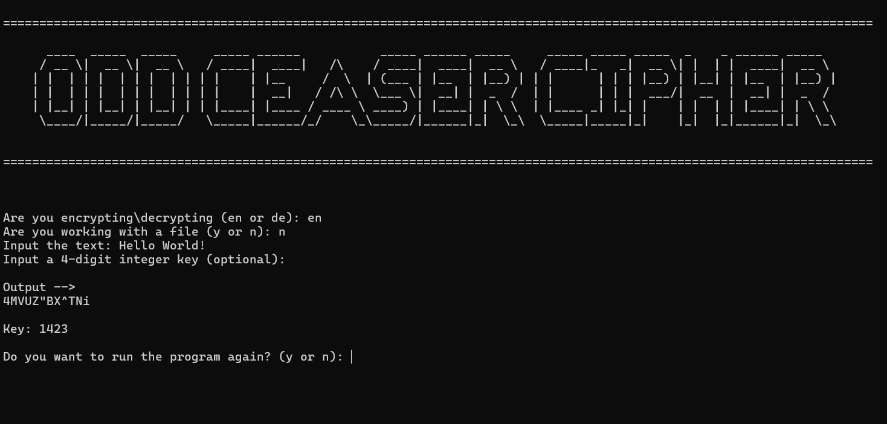
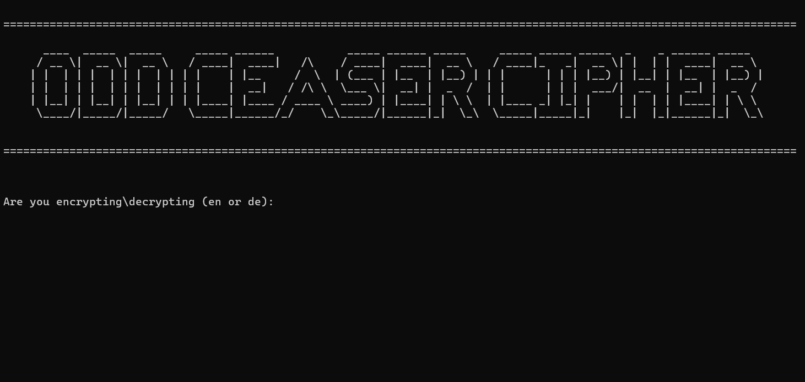

# Odd Ceaser Cipher

The Odd Ceaser Encryption and Decryption Tool is a command-line application written in JavaScript that uses an
algorithm similar to the Vigenere Cipher to encrypt and decrypt messages. The tool accepts both files and text as
input.

## Installation

The application can be installed through github [here](https://github.com/king525dev/odd-ceaser-cipher/releases/tag/v1.0.0) or [here](https://github.com/king525dev/odd-ceaser-cipher/tree/main/dist)

- [Version 1.0](./dist/v1/oddCeaser-win.exe)
- [Version 1.1](./dist/OddCeaser.exe)

## Usage/Examples

## Hot Keys

- `k` : This will kill the program at any stage.
- `r` : This will restart the program at any stage.

## License

- [MIT](https://choosealicense.com/licenses/mit/)
- [ORE.A. License](extras/license.txt)

## Badges

   

## Authors

 **[@king525dev](https://github.com/king525dev)**

 For more information on the author click [here](https://king525-portfolio.pages.dev/).

 <!-- ORE.A. ORIGINAL -->